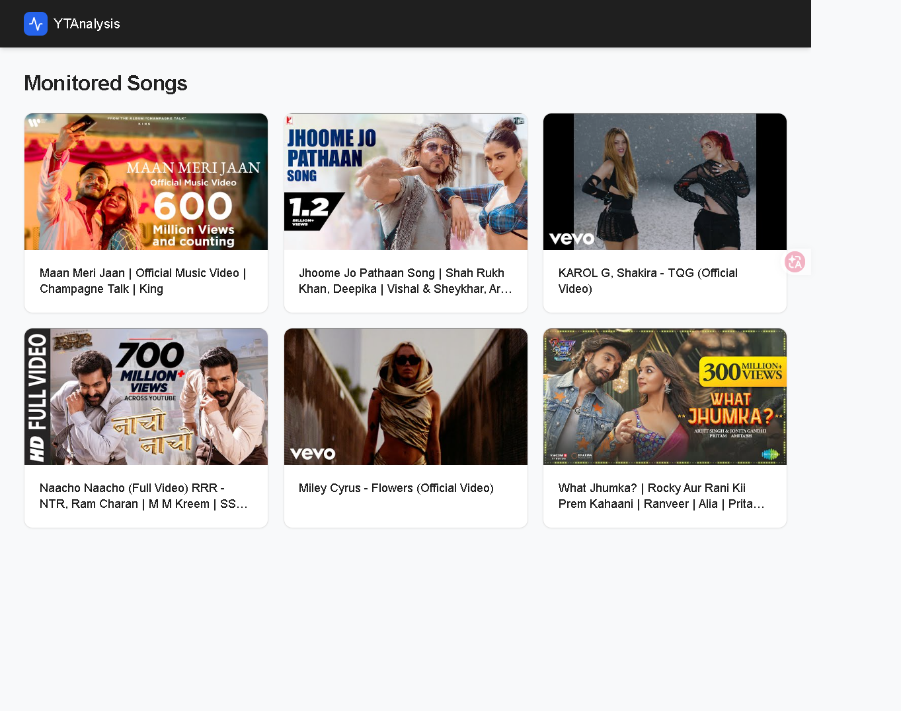

# YouTube Views Analytics Dashboard 📊



A professional full-stack web application designed to monitor and analyze YouTube video view trends in real-time. This project is the **v2 web evolution** of the original CLI-based [youtube-views-tracker](https://github.com/vivekmaury35/youtube-views-tracker), replacing terminal logs with a modern, data-driven dashboard.

## 🚀 Core Features

*   **Automated View Tracking:** Continuously monitors a list of specific YouTube videos and records view count changes.
*   **Smart API Key Rotation:** Implements a round-robin rotation strategy across multiple Google API keys, allowing for higher polling frequency and bypassing strict YouTube Data API v3 quota limits.
*   **Historical Gain/Loss Analysis:** Stores time-series snapshots in a database to calculate "Gain/Loss" (view velocity) between updates.
*   **Interactive Dashboard:** A React-based interface featuring:
    *   **Dashboard Overview:** High-level cards showing current views for all monitored videos.
    *   **Detailed History:** Dedicated pages for each video with a comprehensive history table showing exact timestamps and view changes.
    *   **Time Filtering:** Ability to filter history by "Today" or "Yesterday" based on the user's timezone.

## 🛠️ Technical Architecture

The project follows a classic decoupled client-server architecture:

**Frontend (The View)**
*   **React 19 + Vite**: For a fast, responsive Single Page Application (SPA).
*   **Tailwind CSS**: Used for a modern, dark-themed professional aesthetic.
*   **Axios**: Handles asynchronous communication with the FastAPI backend.

**Backend (The Engine)**
*   **FastAPI**: High-performance Python framework for the REST API.
*   **Asynchronous Monitoring**: A background loop that polls the YouTube API and updates the database every 60 seconds.
*   **SQLite + SQLAlchemy**: A structured relational database storing `Video` metadata and `History` time-series data, optimized with composite indexing for fast date-range queries.

## 💻 Local Setup Guide

### 1. Clone the repository
```bash
git clone https://github.com/vivekmaury35/YouTube-Views-Analytics-Dashboard.git
cd YouTube-Views-Analytics-Dashboard
```

### 2. Backend Configuration
Ensure you have Python 3.10+ installed.

```bash
# Install dependencies
pip install -r requirements.txt

# Setup Environment Variables
# Create a .env file in the root directory and add your API keys:
# YOUTUBE_API_KEYS=your_key_1,your_key_2,your_key_3
```

Start the backend server:
```bash
uvicorn app.main:app --reload
```

### 3. Frontend Configuration
Open a new terminal window.

```bash
cd yt-views-frontend
npm install
npm run dev
```
The dashboard will be available at `http://localhost:5173`.

## 🔄 Evolution from v1
| Feature | v1 (CLI) | v2 (Full-Stack) |
| :--- | :--- | :--- |
| **Interface** | Terminal / Console | Interactive Web Dashboard |
| **Storage** | Ephemeral/File-based | Structured SQLite Database |
| **API Management** | Single Key | Automated Multi-Key Rotation |
| **Analysis** | Manual Inspection | Time-series Gain/Loss Tracking |

## 📝 License
This project is open-source and available under the MIT License.